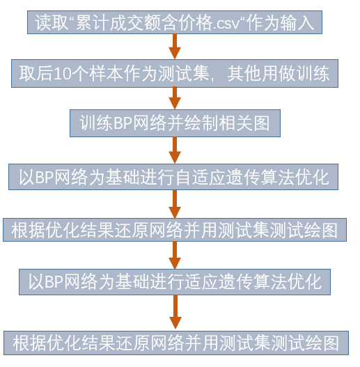

# 《基于AGA-BP神经网络的网络平台交易环境下数据资源价值评估研究》Python实现

本仓库代码提供了《基于AGA-BP神经网络的网络平台交易环境下数据资源价值评估研究》的python实现。

## 代码模块

代码文件结构如下：

```
.
├── ga
│   ├── adga.py
│   ├── gabp.py
│   ├── ga.py
│   └── __init__.py
├── main.py
├── README.md
├── requirements.txt
├── test
│   ├── __init__.py
│   └── UT.py
├── util.py
└── 累计成交额含价格.csv
```

其中`累计成交额含价格.csv`是数据集; `main.py`是程序运行主入口; `util.py`定义了一些辅助函数; `ga`包包括了最主要的模型代码, `gabp.py`是遗传算法-BP训练的基类, `ga.py`定义了GA-BP需要的相关函数, `adga.py`定义了AGA-BP需要的相关函数。

## 模型细节

`main.py`是程序运行主入口在其中划分了数据集定义了超参数, 训练BP网络，进行自适应遗传算法优化和遗传算法优化。

GA和AGA的模型实现完全根据遗传算法和自适应遗传算法的相关知识，这两个模型都定义了“选择、变异、交叉”这三个操作，并不断迭代。其中自适应模型和普通遗传算法模型的区别是自适应模型的“变异、交叉”操作的概率动态变化。

## 流程图



